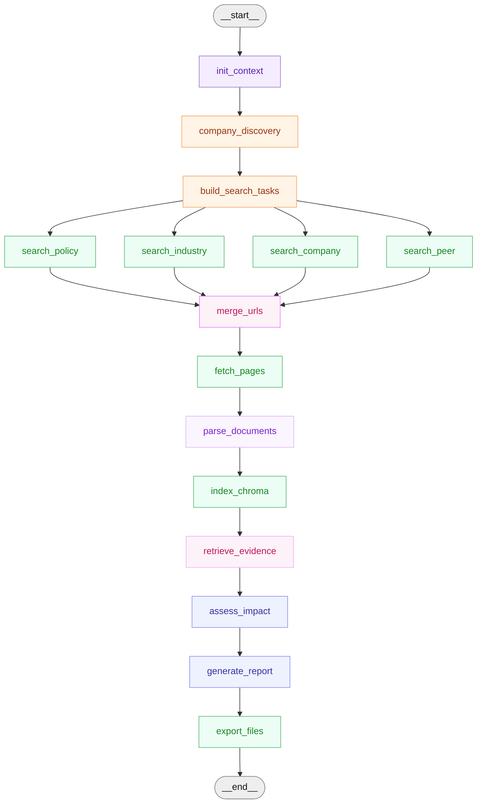

<div align="center">
  <h1>ESG RAG Monthly Report Agent</h1>
</div>

<div align="center">
  <h3>Evidence-backed ESG monthly report generation with LangGraph, Chroma, Browser Fetch, MinerU, and LLM reranking.</h3>
</div>

<div align="center">
  <a href="https://www.python.org/" target="_blank"></a>
  <a href="https://www.langchain.com/langgraph" target="_blank"></a>
  <a href="https://www.trychroma.com/" target="_blank"></a>
  <a href="https://playwright.dev/python/" target="_blank"></a>
  <a href="https://github.com/opendatalab/MinerU" target="_blank"></a>
</div>

<br>

面向 ESG 月度监测的 RAG 工作流。默认公司为“中国神华”，资料按 `policy`、`industry`、`company`、`peer` 四类来源组织，覆盖候选召回、网页/PDF 抓取、正文解析、向量入库、证据重排、影响评估和报告导出。

```bash
python main.py --company 中国神华 --anchor-date 2026-06-29 --reset
```

> [!TIP]
> 输出内容适合作为研究和内部评审材料；用于正式披露前，应补充公司内部数据、业务确认和合规审阅。

## Sample Generated Report

> [!TIP]
> **Full sample report entry:** expand the section below to view the generated ESG monthly report, including management recommendations and the evidence appendix.

<details>
<summary>
<strong>FULL SAMPLE REPORT: China Shenhua ESG monthly draft (2026-05-29 to 2026-06-29)</strong><br>
<span>Click to expand the generated report body, recommendations, and evidence appendix.</span>
</summary>

# 中国神华 ESG月报草稿
报告周期：2026-05-29 至 2026-06-29

## 一、本月摘要
本月，中国神华的低碳技术布局和公司治理结构均发生了标志性事件。国能锦界公司400万吨/年CCUS示范工程项目成功取得建设工程规划许可，标志着公司碳捕集技术从规划进入合规建设阶段，这不仅是对“煤电+CCUS”转型路径的实质性投入，也直接响应了投资者对气候技术可行性的关注。与此同时，两名独立非执行董事因任期届满离任，独立董事人数及专业委员会构成暂时不符合监管规定，这一治理过渡期需尽快完成补选，以避免引发市场对公司治理合规性的疑虑。

结合本月发布的发电设施温室气体排放核算与核查技术指南更新，以及交易所对可持续发展报告披露质量的持续要求，煤电企业的碳排放数据治理已成为评级和合规的双重焦点。公司应将CCUS项目进展与碳管理数据升级为月度跟踪议题，把技术进展转化为可量化、可沟通的ESG叙事，同时在投资者沟通中主动说明独立董事补选时间表，以稳定治理预期。

## 二、ESG政策、评级、标准动态
本月ESG政策与标准动态主要集中在碳排放数据质量和披露规范性两方面，对以煤电一体化为核心业务的中国神华具有直接的操作含义。

- **生态环境部更新发电设施温室气体排放核算与核查技术指南**：本月，生态环境部更新了《企业温室气体排放核算与报告指南 发电设施》和《企业温室气体排放核查技术指南 发电设施》的技术要求，旨在进一步规范全国碳市场发电企业的碳排放数据报告与核查工作。对于中国神华而言，其火电板块的碳排放核算边界、方法学和数据质量将面临更严格的合规审查，任何核算或报告缺陷都可能导致碳市场履约风险。建议公司立即组织碳排放责任部门和第三方核查机构，对照新版技术要求进行差距分析，并在内部梳理涉及发电设施的核算边界变动、燃料数据来源和排放因子取值方法，确保下一履约周期的报告如期合规。

- **交易所持续关注煤炭电力企业的披露“颗粒度”**：交易所观察指出，煤炭和电力企业的披露难点在于业务链条长、数据口径多，因此应将煤炭生产、火电运营、运输港口和煤化工纳入统一的ESG数据治理框架，并披露隐患排查、承包商管理、生态修复投入等量化指标。对此，中国神华应利用月度数据看板，将发电煤耗、供电煤耗、碳配额缺口、环保设施运行效率和安全生产培训覆盖率等指标与报告披露联动，避免仅在年报季集中整理，从而减少临时响应压力。

- **气候信息披露要求指向清晰的转型路径说明**：监管趋势要求企业避免用原则性表述替代事实，应说明碳市场履约、火电机组灵活性改造、甲烷治理和CCUS（碳捕集利用与封存）探索的具体进展与时间表。这对公司本月取得的CCUS项目规划许可构成了直接的政策利好——该进展恰恰是监管希望企业披露的“可验证事实”。建议投资者关系部将此进展更新到与评级机构和投资者沟通的核心叙事中，作为公司“经营型ESG”的例证。

## 三、客户所属行业动态与最佳实践
本报告期内，煤炭与火电行业在绿色矿山、安全生产和低碳转型方面持续形成新的最佳实践，对公司有较强的参照意义。

- **绿色矿山建设成为行业标配，披露要求从“有没有”转向“好不好”**：行业实践显示，绿色矿山不再是单一的环保工程，而是集智能开采、资源综合利用、矿区生态修复、水土保持、粉尘治理和安全生产于一体的协同议题。领先企业已开始按矿区分层披露土地复垦面积、植被恢复进度、矸石利用率、矿井水处理达标率和安全培训覆盖率，以便投资者判断管理质量。建议公司在下一期ESG报告中，评估是否可以向矿区和业务线颗粒度进一步拆解环境和社会数据。

- **火电企业建立月度指标看板成为风险预警的最佳实践**：行业研究指出，面对持续上升的低碳转型压力，领先的煤电企业已建立月度指标看板，跟踪发电煤耗、供电煤耗、环保设施运行、碳配额缺口、安全生产事件和重大检修安排，并将这些数据与ESG报告、评级问卷和投资者问答联动。中国神华可借鉴这一做法，由ESG团队牵头，协同生产、安环和碳资产管理部门，形成内部月度简报，将运营数据转化为ESG管理信息，降低评级更新时的数据突击压力。

- **甲烷治理有望成为下一个披露热点**：行业观察显示，甲烷的监测、抽采利用和减排效果正成为煤炭企业新的披露重点，未来可能是投资者提问的方向。建议公司提前评估现有瓦斯抽采数据的统计边界、利用量和减排效果，为潜在的披露要求做好准备。

## 四、客户公司动态、ESG影响与对标企业关键行动

### 4.1 中国神华近期公司动态、ESG影响与建议

#### 事项一：国能锦界公司400万吨/年CCUS示范工程取得规划许可
- **发生了什么**：6月29日，国能锦界公司400万吨/年CCUS示范工程项目取得神木高新技术产业开发区管理委员会核发的建设工程规划许可证。项目将分两期建设，每期形成200万吨/年碳捕集能力。
- **ESG影响**：此举直接正面影响环境（E）维度，体现公司在低碳技术和煤电清洁化转型上进行了实质性的资本部署与合规推进。从治理（G）角度看，项目在7个月内高效完成选址、用地和工程规划许可，展示了集团在复杂项目合规管理上的执行力。
- **风险/机会**：这主要是一个机会。它为公司的低碳转型叙事提供了硬核证据，有助于在评级和融资中建立先发优势。需关注的风险是项目未来的技术经济性，但这属于长期跟踪事项，当前无直接信号。
- **建议动作**：建议环境管理部门将CCUS项目规划许可纳入下一期可持续发展报告的“气候转型与创新”章节，披露规划总投资、预期捕集量及与集团碳减排目标的关联。投资者关系部可围绕此事准备简明问答，回应“煤电定位与脱碳路径”的常见提问。

#### 事项二：两名独立非执行董事因任期届满离任
- **发生了什么**：5月29日，公司公告独立非执行董事袁国强博士、陈汉文博士因连续任职满六年而辞去所有职务。离任导致独立董事人数及专业委员会中独立董事比例暂时不合规，且独立董事中缺少会计专业人士。公司表示将尽快完成补选。
- **ESG影响**：直接影响治理（G）维度，涉及董事会独立性、专业能力构成及合规性。此事若处理周期过长，可能引发评级机构对公司治理稳定性的关注。
- **风险/机会**：风险在于治理合规的短期缺口。机会在于，公司可籍此补选机会，引入具有能源转型、气候科技或ESG专长的独立董事，优化董事会专业结构。
- **建议动作**：建议合规治理部门在月报期内明确补选时间表并适时对外沟通。更新公司官网的“治理架构”与“董事会构成”信息，并在后续ESG报告中披露独立董事的专业背景构成。

### 4.2 本月客户公司影响判断
本月的两项核心动态分别从“G”（治理）和“E”（环境）两个维度影响公司。独立董事离任是一个需要快速闭合的治理过渡事件，虽然源于合规任期限制，但反映了“关键人”变动对公司治理连续性管理的考验。建议将独立董事补选进展作为未来一至两个月的最高优先级跟踪项，以防止治理议题在下次评级更新中出现弱点。

CCUS项目规划许可的获取则是一个典型的“经营型ESG”信号。它不仅是新闻，更是一个可量化的里程碑：项目从规划走向合规建设。这直接支撑了公司“煤电+CCUS”的低碳转型叙事，也为回应监管对气候转型路径的披露要求提供了过硬的事实。建议将CCUS技术进展与火电碳排放核算合规要求整合成一套完整的“碳管理月报”，使技术进展、合规动作和数据治理形成闭环。当前，对标企业已在绿色矿山和安全生产披露上展现出更高颗粒度，公司可借鉴这一点，将CCUS项目进展纳入同样精细化的披露轨道。

### 4.3 对标企业 ESG 关键行动
本月证据覆盖的对标企业行动主要集中在绿色矿山建设、安全管理披露和生态修复实践方面，为公司提供了横向参照。

- **中煤能源（绿色矿山与安全管理）**：据此样本，中煤能源持续披露绿色矿山、智能化矿山、安全生产和生态修复行动，具体包括项目投入、修复面积、培训人次数及事故率。这提示中国神华可审视自身在绿色矿山议题上的披露颗粒度，评估是否能提供同等级别的量化证据。
- **陕西煤业（生态修复与投资者沟通）**：据此样本，陕西煤业在生态修复方面披露了土地复垦、植被恢复、水资源保护和固废综合利用，并围绕碳排放、资本开支和绿色转型与投资者形成稳定沟通。这提示公司可将生态修复与投资者沟通结合起来，使修复投入成为“公正转型”沟通的一部分。

### 4.4 章节结论
本月月报显示，中国神华的ESG管理正从“披露型”向“经营型”过渡。CCUS项目取得规划许可，不是被动回应政策，而是主动部署技术的经营行为，它必须与碳数据治理、合规履约和投资者叙事紧密联动，才能最大化其ESG价值。同样，独立董事补选也不应仅仅是为满足合规门槛，而应成为优化董事会专业结构、提升治理韧性的契机。月报的角色，正是在这些动态之间建立关联，将分散的公告和新闻转化为对管理决策有用的风险提示、机会识别和行动指令，而不是新闻的简单汇总。

## 五、下月建议关注事项
1. **独立董事补选进展**：重点关注公司是否在股东大会上完成补选并公告，新任独立董事的专业背景能否覆盖会计、法律及能源转型等领域。
2. **温室气体核算指南的内部合规进展**：跟踪碳排放责任部门对新版核算与报告指南的差距分析结果，特别是对发电设施关键参数取值的梳理情况。
3. **安全生产与防汛度夏**：7月进入迎峰度夏关键期，应关注煤矿和电厂的安全生产、承包商管理及应急演练情况，这是社会（S）维度的月度重点。
4. **CCUS项目的后续信息披露规划**：策划该项目进展如何在中报或可持续发展报告中披露，以清晰展示里程碑、投资和未来计划。

## 六、证据索引与来源附录

### 正文证据索引表
| 正文位置 | 证据编号 | 证据说明 |
|---|---|---|
| 一、本月摘要 | E53 | 国能锦界公司400万吨/年CCUS示范项目取得建设工程规划许可 |
| 一、本月摘要 | E46 | 两名独立非执行董事因任期届满离任的公告 |
| 二、ESG政策、评级、标准动态 | E04， E06， E08， E12 | 生态环境部更新发电设施温室气体排放核算与核查技术指南 |
| 二、ESG政策、评级、标准动态 | E03， E09， E10 | 交易所对煤炭电力企业ESG披露难点与建议的观察 |
| 二、ESG政策、评级、标准动态 | E02 | 气候信息披露要求指向清晰的转型路径说明，如CCUS探索 |
| 三、客户所属行业动态与最佳实践 | E23， E24 | 行业推动绿色矿山建设，要求按矿区分层披露关键指标 |
| 三、客户所属行业动态与最佳实践 | E22， E29 | 火电企业建立月度指标看板以强化风险预警和披露联动 |
| 三、客户所属行业动态与最佳实践 | E26， E27 | 甲烷治理有望成为煤炭企业下一个披露热点 |
| 四、事项一 | E53， E55， E57， E60 | 国能锦界CCUS项目规划许可详情及建设计划 |
| 四、事项二 | E46 | 独立非执行董事离任公告详情及对公司治理合规的暂时性影响 |
| 四、对标企业 | E61 | 中煤能源持续披露绿色矿山、安全生产和生态修复的量化行动 |
| 四、对标企业 | E63 | 陕西煤业在生态修复和投资者沟通方面的实践 |

### 联网来源表
| 证据编号 | 标题 | 来源 | 日期 | URL | 是否支撑正文 | 未支撑正文原因 |
|---|---|---|---|---|---|---|
| E53 | 国能锦界公司400万吨/年CCUS示范工程项目取得规划许可 | 中国神华 | 2026-06-29 | http://www.shenhuachina.com/zgshww/gsxw/202606/a6161437344548cd9b69fd9e8bf2b66a.shtml | 是 | 不适用 |
| E46 | 中国神华能源股份有限公司关于独立非执行董事离任的公告 | 上海证券报 | 2026-05-29 | https://paper.cnstock.com/html/2026-05/29/content_2223245.htm | 是 | 不适用 |

</details>

## Updated in this version

当前版本重点放在证据质量、资料可移植性、报告可读性和运行复现。

| Area | What changed | Why it matters |
|---|---|---|
| **Evidence Quality** | Added `evidence_reranker`: embedding wide retrieval first, then LLM reranking for `company` and `peer` chunks. | Reduces false positives where a chunk is topic-related but cannot actually support the report. |
| **Portable Sources** | `manual_sources.csv` now supports project-relative `local_path` for local HTML/PDF files. | The project can be moved or cloned without breaking local source references. |
| **Source Coverage** | Added and classified local sources across `policy`, `industry`, `company`, and `peer`. | Remote URLs, local HTML, local PDF, and online PDF can enter one unified pipeline. |
| **Report Readability** | Moved dense `[E..]` citations out of the body and into the final evidence index/source appendix. | The generated report reads more like a business monthly report while staying traceable. |
| **Run Hygiene** | Added `RUNBOOK.md`, refreshed `MANIFEST.txt`, and expanded `.gitignore`. | Keeps setup, validation, and delivery cleaner; excludes `.env`, caches, and runtime artifacts. |
| **LangSmith / Studio** | Added `langgraph.json`, `studio_graph`, and LangSmith OpenAI tracing wrapper. | The graph can run in LangGraph Studio and send node/model traces to LangSmith when enabled. |
| **Verified Output** | Synced `examples/` with the latest full run: fetch `35/35`, parse `35/35`, no reranker/assessment/report fallback. | Provides a reproducible reference output for checking expected behavior. |

## Why use this project?

ESG 月报的关键不在于汇总新闻，而在于把外部变化转化为可追溯的管理判断。该工作流重点处理四个问题：资料覆盖、证据质量、报告结构和运行可复查。

- **Evidence-backed generation**：报告生成阶段只读取 `evidence.json` 和 `impact_assessments.json`。
- **Section-aware retrieval**：将资料分为 `policy`、`industry`、`company`、`peer` 四个分支，分别召回和评分。
- **Candidate queue separation**：候选层与抓取队列层分离，方便并行检索、全局去重、排序和调试。
- **Multi-format ingestion**：支持远程网页、本地 HTML、本地 PDF、在线 PDF，并统一解析成 Markdown。
- **Rerank narrow after retrieve wide**：先用 embedding 大范围召回，再用 LLM 判断证据是否真正可支撑报告。
- **Debuggable pipeline**：每个关键中间产物都会落盘，包括候选、抓取、解析、chunk、证据、重排决策和 metrics。

## Architecture

### Workflow

```text
manual_sources.csv / search_api
        ↓
section_candidate_retriever
        ↓
RankedUrlCandidate[]
        ↓
search_policy / search_industry / search_company / search_peer
        ↓
merge_urls_node
        ↓
url_queue
        ↓
browser_worker
        ↓
HTML / PDF raw files
        ↓
html_parser / mineru_parser
        ↓
Markdown documents
        ↓
chunker
        ↓
Chroma vector store
        ↓
embedding retrieval
        ↓
evidence_reranker
        ↓
impact_assessment
        ↓
report_generator
        ↓
report.md / evidence.json / impact_assessments.json / metrics.json
```

### LangGraph nodes

This Mermaid graph mirrors the LangGraph Studio node layout and renders directly on GitHub.



### Graph node format

LangGraph uses `ESGWorkflowState` as the shared state. Each node receives the current state and returns only the fields it wants to update; LangGraph then merges those partial updates into the next state.

```python
def some_node(state: ESGWorkflowState) -> dict:
    return {
        "state_key": value,
        "metrics": {...},
        "errors": [...],
    }
```

The four search branches use a fan-out/fan-in pattern: `build_search_tasks` dispatches to `search_policy`, `search_industry`, `search_company`, and `search_peer`; `merge_urls` waits for all four branches and then builds one unified fetch queue.

| Node | Role | Main state input | Main state output / artifacts |
|---|---|---|---|
| `init_context` | Initialize the reporting run. | `company`, `anchor_date` | `run_id`, `period_start`, `period_end`, `run_paths`, `chroma_path`, `collection_name`, base `metrics`. |
| `company_discovery` | Build the company profile and peer list. | `company` | `company_profile`, `queue/company_profile.json`, peer count metric. |
| `build_search_tasks` | Create section-aware search plans. | `period_start`, `period_end` | `search_tasks`, `queue/search_tasks.json`, search task count metric. |
| `search_policy` | Retrieve ESG policy, rating, and standard candidates. | `search_tasks`, report period | Appends `url_candidates`; writes policy scoring/debug files under `queue/`. |
| `search_industry` | Retrieve sector news and best-practice candidates. | `search_tasks`, report period | Appends `url_candidates`; writes industry scoring/debug files under `queue/`. |
| `search_company` | Retrieve client-company announcements and news. | `search_tasks`, report period | Appends `url_candidates`; writes company scoring/debug files under `queue/`. |
| `search_peer` | Retrieve peer-company ESG action candidates. | `search_tasks`, report period | Appends `url_candidates`; writes peer scoring/debug files under `queue/`. |
| `merge_urls` | Normalize, deduplicate, and rank all URL candidates. | `url_candidates` | `url_queue`, `queue/url_candidates.json`, `queue/url_queue.json`, `queue/url_metrics.json`. |
| `fetch_pages` | Fetch remote URLs and local `file://` sources. | `url_queue` | `fetched_docs`, raw HTML/PDF files, screenshots/metadata when available, `queue/fetched_docs.json`. |
| `parse_documents` | Route HTML to the HTML parser and PDF to MinerU. | `fetched_docs` | `parsed_docs`, discovered PDF attachments, `queue/parsed_docs.json`, `queue/discovered_pdf_candidates.json`. |
| `index_chroma` | Chunk parsed Markdown and write vectors to Chroma. | `parsed_docs`, `chroma_path`, `collection_name` | `chunks`, `queue/chunks_preview.json`, Chroma collection records. |
| `retrieve_evidence` | Retrieve section evidence and optionally run LLM reranking. | `chunks` in Chroma, section retrieval queries | `evidence_pack`, `reports/evidence.json`, `reports/evidence_raw.json`, `reports/evidence_rerank_decisions.json`. |
| `assess_impact` | Convert evidence into ESG impact assessments. | `evidence_pack` | `impact_assessments`, `reports/impact_assessments.json`; uses fallback only if the LLM call fails. |
| `generate_report` | Generate the monthly report from evidence and assessments. | `evidence_pack`, `impact_assessments`, `parsed_docs` | `report_markdown`, report length/fallback metrics. |
| `export_files` | Persist final report package and runtime diagnostics. | `report_markdown`, `evidence_pack`, `impact_assessments`, `metrics`, `errors` | `reports/report.md`, `reports/evidence.json`, `reports/impact_assessments.json`, `reports/metrics.json`, `reports/errors.json`. |

## Project layout

```text
.
├── app.py                         # Streamlit UI
├── main.py                        # CLI entrypoint
├── graph.py                       # LangGraph orchestration
├── config.py                      # Company, model, retrieval, and directory config
├── langgraph.json                 # LangGraph Studio / API server configuration
├── schemas.py                     # Pydantic / TypedDict schemas
├── manual_sources.csv             # Curated source registry
├── requirements.txt               # Python dependencies
├── .env.example                   # Environment variable template
├── .gitignore                     # Excludes secrets, caches, and generated runtime artifacts
├── RUNBOOK.md                     # Run and validation checklist
├── MANIFEST.txt                   # File manifest
├── agents/
│   ├── company_discovery.py
│   ├── search_agents.py
│   ├── agent_reranker.py
│   ├── impact_assessment.py
│   └── report_generator.py
├── services/
│   ├── section_candidate_retriever.py
│   ├── merge_urls_node.py
│   ├── light_crawler.py
│   ├── search_api.py
│   ├── browser_worker.py
│   ├── html_parser.py
│   ├── mineru_parser.py
│   ├── pdf_link_extractor.py
│   ├── chunker.py
│   ├── chroma_store.py
│   ├── embedding_client.py
│   ├── evidence_reranker.py
│   ├── langsmith_utils.py
│   ├── llm_client.py
│   └── exporter.py
├── data/manual_sources/           # Curated HTML/PDF examples by section
├── examples/                      # Verified sample outputs
└── runs/                          # Runtime output directory
```

## Quickstart

### 1. Install dependencies

Python 3.11 is recommended.

```bash
pip install -r requirements.txt
python -m playwright install chromium
```

If using conda:

```bash
conda create -n esg-rag python=3.11
conda activate esg-rag
pip install -r requirements.txt
python -m playwright install chromium
```

PDF parsing depends on the external MinerU CLI:

```bash
mineru --help
```

### 2. Configure environment variables

```bash
cp .env.example .env
```

Fill in an OpenAI-compatible LLM and embedding service:

```bash
LLM_API_KEY=
LLM_BASE_URL=
LLM_MODEL=

EMBEDDING_API_KEY=
EMBEDDING_BASE_URL=
EMBEDDING_MODEL=
```

Default source mode:

```bash
SEARCH_PROVIDER=manual
MANUAL_SOURCES_PATH=manual_sources.csv
RERANK_ENABLED=true
RERANK_SECTIONS=company,peer
MINERU_CMD=mineru
```

Do not commit `.env`.

### 3. Run the full pipeline

```bash
python main.py --company 中国神华 --anchor-date 2026-06-29 --reset
```

Expected outputs:

```text
runs/2026-06-29_中国神华/reports/report.md
runs/2026-06-29_中国神华/reports/evidence.json
runs/2026-06-29_中国神华/reports/evidence_raw.json
runs/2026-06-29_中国神华/reports/evidence_rerank_decisions.json
runs/2026-06-29_中国神华/reports/impact_assessments.json
runs/2026-06-29_中国神华/reports/metrics.json
runs/2026-06-29_中国神华/reports/errors.json
```

### 4. Run Streamlit UI

```bash
streamlit run app.py
```

### 5. Run LangGraph Studio / LangSmith tracing

The project includes `langgraph.json`, which exposes the compiled graph as:

```text
esg_monthly_report -> ./graph.py:studio_graph
```

To validate the Studio configuration:

```bash
langgraph validate
```

To start the local LangGraph API server used by Studio:

```bash
langgraph dev --allow-blocking --no-browser --port 2024
```

Then open LangSmith Studio and set the API server URL to:

```text
http://127.0.0.1:2024
```

If Studio shows `Failed to fetch`, the local API server is not running or the browser cannot reach it. Keep the `langgraph dev` process running while using Studio.

Optional LangSmith tracing:

```bash
LANGSMITH_TRACING=true
LANGSMITH_API_KEY=
LANGSMITH_PROJECT=ESG-RAG-Monthly-Report
```

## Manual source format

`manual_sources.csv` supports remote URLs and project-relative local files:

```csv
url,local_path,section_hint,priority,pinned,expected_date,source_type_hint,source_name_hint,tags,note
```

Local source example:

```csv
,data/manual_sources/company/company_01.html,company,4,false,2026-06-08,html,中国神华样例,中国神华安全生产与绿色运营动态,公司动态 HTML
```

Remote source example:

```csv
https://paper.cnstock.com/html/2026-05/29/content_2223245.htm,,company,4,false,2026-05-29,url,上海证券报,中国神华独立非执行董事离任公告,治理事件观察
```

| Field | Purpose |
|---|---|
| `url` | Remote webpage/PDF URL |
| `local_path` | Project-relative local HTML/PDF path |
| `section_hint` | `policy` / `industry` / `company` / `peer` |
| `priority` | Manual priority, 0-5 |
| `pinned` | Whether the source should be prioritized |
| `expected_date` | Source date, `YYYY-MM-DD` |
| `source_type_hint` | `html` / `pdf` / `url` |
| `source_name_hint` | Source name |
| `tags` | Short title or topic |
| `note` | Why the source matters |

## Verified run

The latest verified outputs are stored in `examples/`.

| Metric | Value |
|---|---:|
| URL candidates | 35 |
| URL queue | 35 |
| Fetch success | 35 |
| Parse success | 35 |
| Chunks | 299 |
| Final evidence | 34 |
| Impact assessments | 5 |
| Evidence rerank fallback | false |
| Impact assessment fallback | false |
| Report fallback | false |
| Report length | 5080 |

## Documentation

- `RUNBOOK.md` — operational checklist, success criteria, and troubleshooting.
- `MANIFEST.txt` — project file inventory.
- `docs/DEMO_OPTIMIZATION.md` — current MVP gaps and follow-up engineering items.
- `examples/generated_report_中国神华_2026-06-29.md` — sample generated report.
- `examples/evidence_中国神华_2026-06-29.json` — final evidence package.
- `examples/metrics_中国神华_2026-06-29.json` — verified run metrics.

## Limitations

- The generated report is a working draft and does not replace ESG, legal, or disclosure review.
- Manual sources are curated for reproducible runs; production deployments should connect broader policy, announcement, news, and internal data feeds.
- PDF parsing speed depends on MinerU and local hardware.
- LLM and embedding APIs must be available for impact assessment, reranking, and report generation.

---

## Acknowledgements

This project uses LangGraph for stateful workflow orchestration, Chroma for vector retrieval, Playwright for browser-based fetching, MinerU for PDF parsing, and OpenAI-compatible LLM/embedding APIs for evidence selection and report generation.
